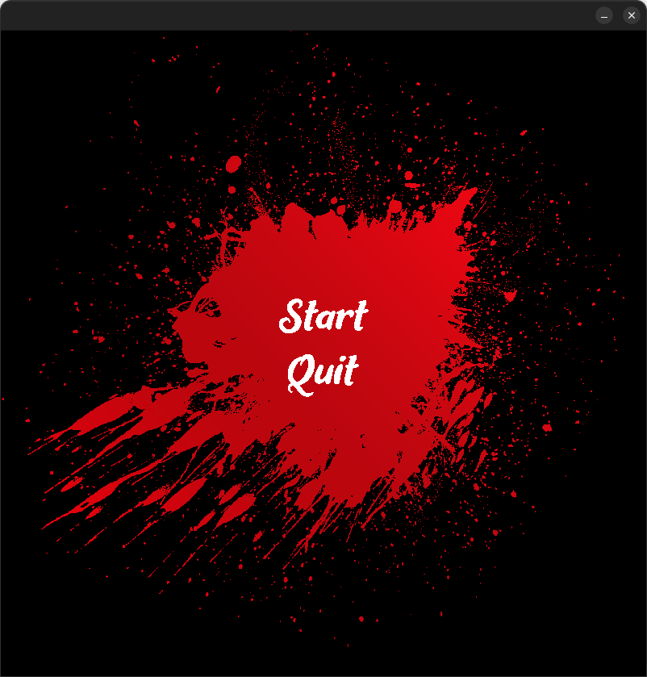
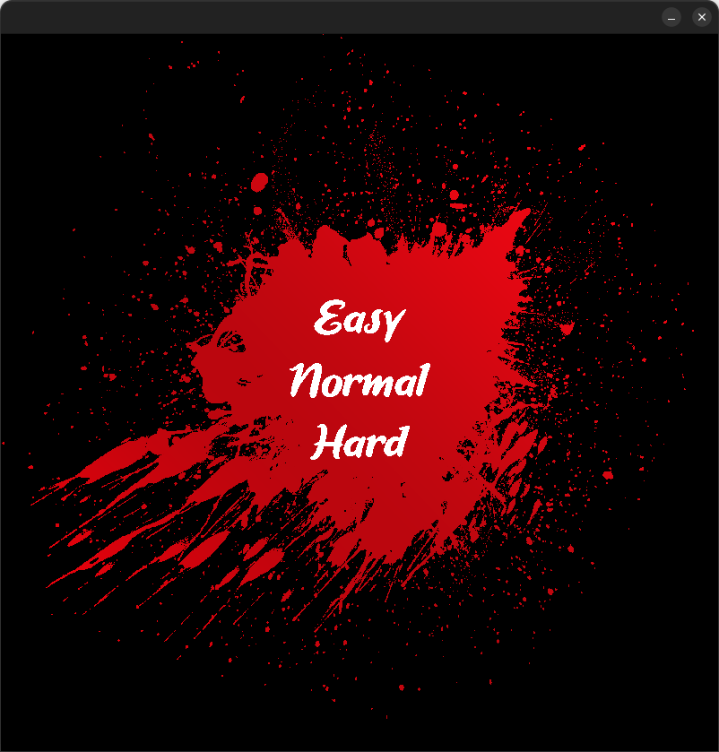
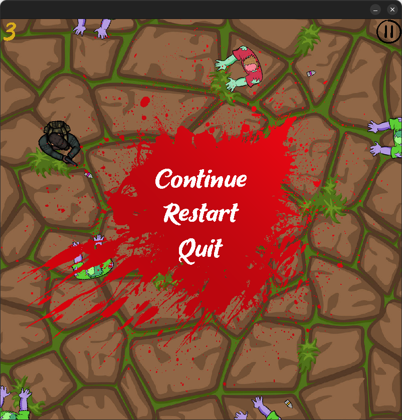

## Description

My endgame(final group project of ucode-connect C maraphone)

## Installation

The project works native on LINUX 
He works on MacOS also if change LINK_DIR value from LINK_DIR_LINUX to LINK_DIR_MAC in makefile.

## Running the game

```bash
#compilation
make
#running the game
./endgame

```

## Game



